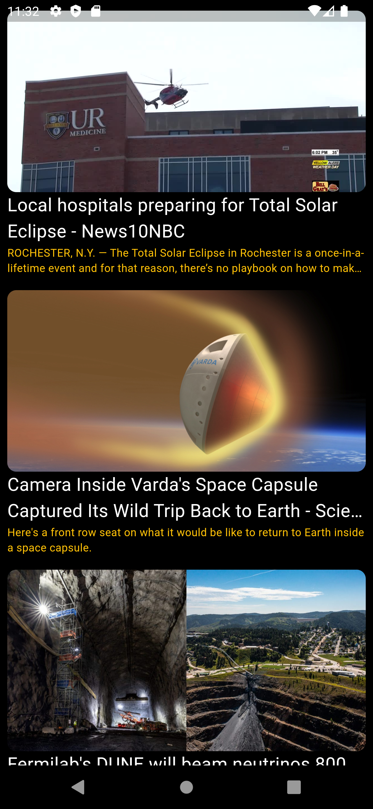

# NewsApp

[](https://flutter.dev/)

## Overview

NewsApp is a Flutter application designed to keep you updated with the latest news. The app features two screens:

1. **Main Screen**:
   - **Horizontal ListView**: Displays news categories for easy navigation.
   - **Vertical ListView**: Shows viral news headlines.

2. **Category Screen**:
   - Displays news articles filtered by the selected category in a vertical ListView.

The app fetches news data from an API using Dio for efficient data retrieval.

## Features

- **Main Screen**:
  - **News Categories**: Browse different news categories horizontally.
  - **Viral News**: View trending news articles vertically.

- **Category Screen**:
  - View news articles specific to the selected category in a vertical list.

## Dependencies

- `cupertino_icons`: ^1.0.2
- `dio`: ^5.4.1

## API Integration

News data is fetched from an API using [Dio](https://pub.dev/packages/dio), a powerful HTTP client for Dart.

## Screenshots

<div style="display: flex; flex-wrap: wrap;">
    <div style="margin: 10px;">
        <p>Main Screen</p>
        
        
    </div>
    <div style="margin: 10px;">
       <p>Category Screen</p>
        
    </div>
</div>

## Getting Started

To get a local copy of the project up and running, follow these steps:

1. **Clone the repository**

   ```bash
   git clone https://github.com/marcolous/Flutter-News.git
   ```
2. Navigate to the project directory:
   ```bash
   cd OtakuNest
   ```
3. Install the dependencies:
   ```bash
   flutter pub get
   ```
4. Run the app:
   ```bash
   flutter run
   ```

## Usage

### Main Screen

- **News Categories**: Scroll horizontally to view different categories.
- **Viral News**: Scroll vertically to view trending news headlines.

### Category Screen

- Click on a category from the main screen to navigate to this screen.
- View a vertical list of news articles related to the selected category.

## Contributing

If you have suggestions for improvements or bug fixes, please open an issue or submit a pull request.

## License

This project is licensed under the MIT License - see the [LICENSE](LICENSE) file for details.

## Contact

If you have any questions or feedback, feel free to reach out to me at [louismarco226@gmail.com](mailto:louismarco226@gmail.com).
